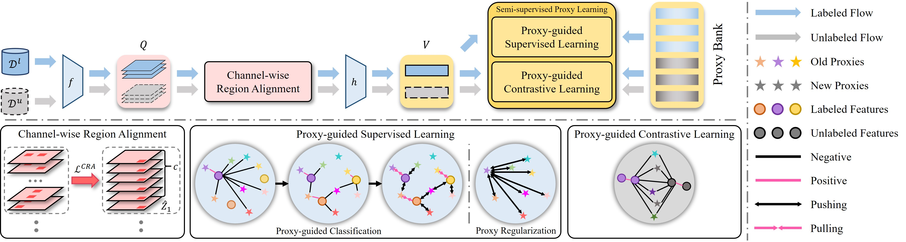

# UFG-NCD
Official pytorch implementation of our paper: "Novel Class Discovery for Ultra-Fine-Grained Visual Categorization" (CVPR2024 **Highlight**)

*Camera-Ready Paper will be released soon.*



## Environment :snake:

Our implementation is based on [uno](https://github.com/DonkeyShot21/UNO), while logging is performed using `wandb`, we use `conda` to create the environment and install the dependencies.

Follow the commands blow to setup environment.

```bash
# create environment
conda create -n rapl python=3.8
conda activate rapl

# choose the cudatoolkit version on your own
conda install pytorch==1.7.1 torchvision==0.8.2 cudatoolkit=11.0 -c pytorch

# install other dependencies
pip install tqdm wandb scikit-learn pandas pytorch-lightning==1.1.3 lightning-bolts==0.3.0 

# create checkpoints directory
mkdir checkpoints
```

## Datasets :floppy_disk:

We use Ultra-FGVC as our main experiment datasets, specifically the `SoyAgeing-{R1, R3, R4, R5, R6}`.

You can download the datasets [here](https://github.com/XiaohanYu-GU/Ultra-FGVC), also make sure you have changed the datasets root that defined in [`config.py`](./config.py).

## Supervised Learning :star2:

```bash
python supervised_learning.py --dataset SoyAgeing-R1 --task ncd
```

## Discovery Learning :sparkles:

```bash
python discovery_learning.py --dataset SoyAgeing-R1 --task ncd --pretrained ncd-supervised-SoyAgeing-R1-pc2.0-cra0.6-reg1.0.pth
```

## Citation :clipboard:

TODO

## Acknowledgements :gift:

- [UNO](https://github.com/DonkeyShot21/UNO)
- [Ultra-FGVC](https://github.com/XiaohanYu-GU/Ultra-FGVC)
